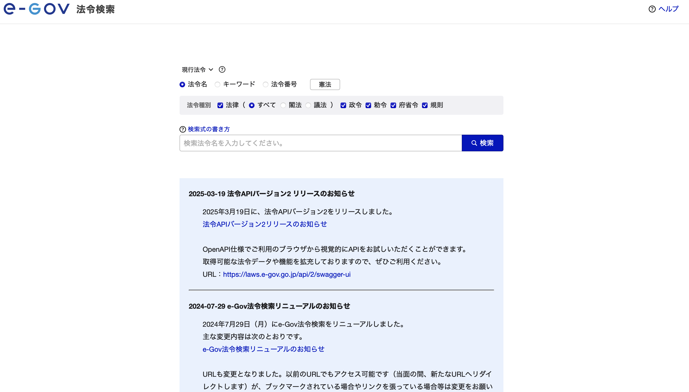
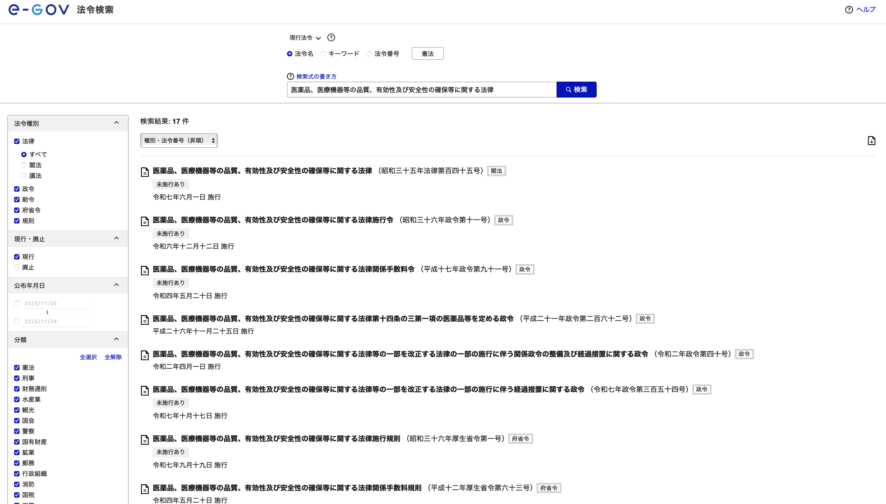
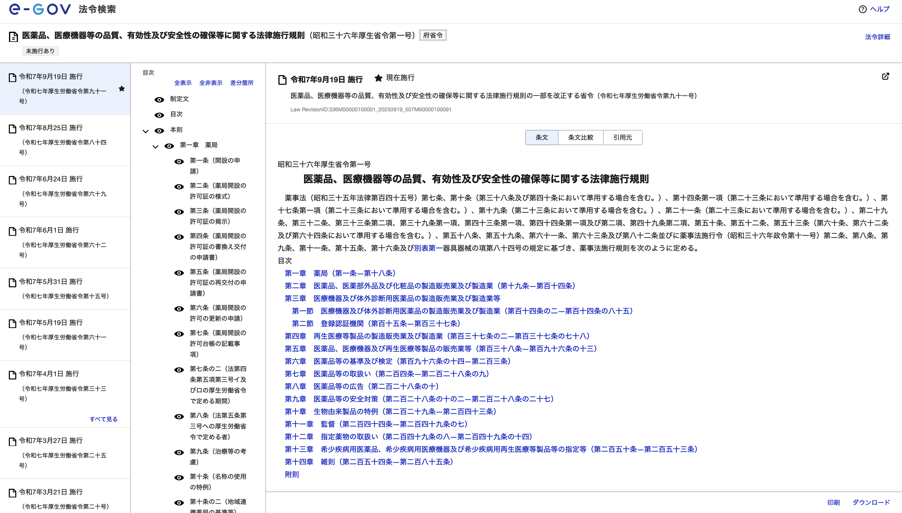
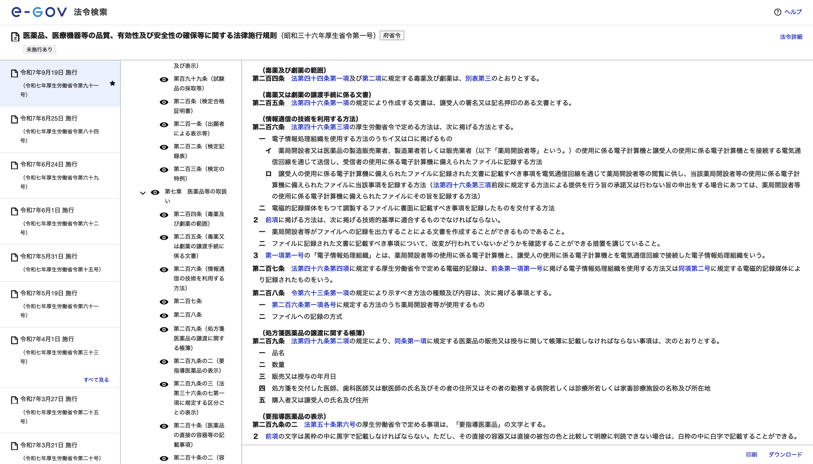
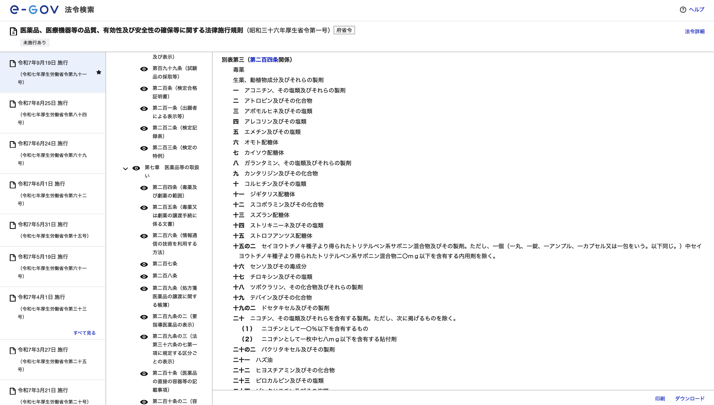
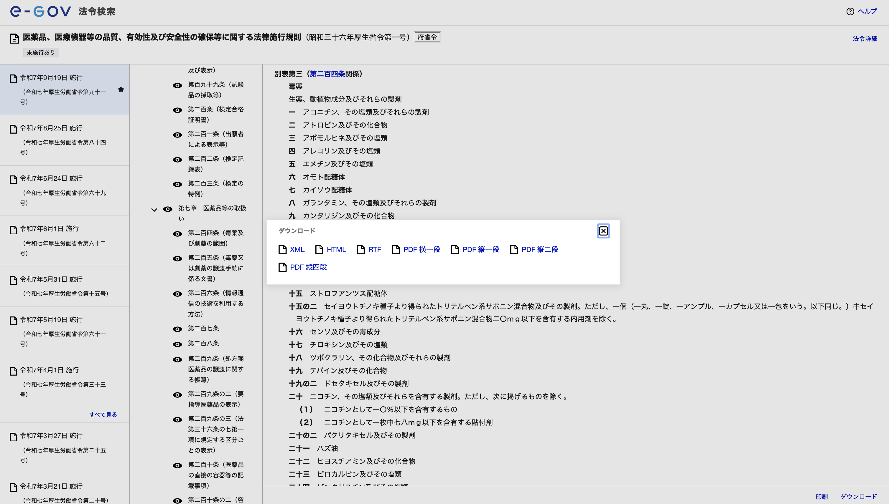
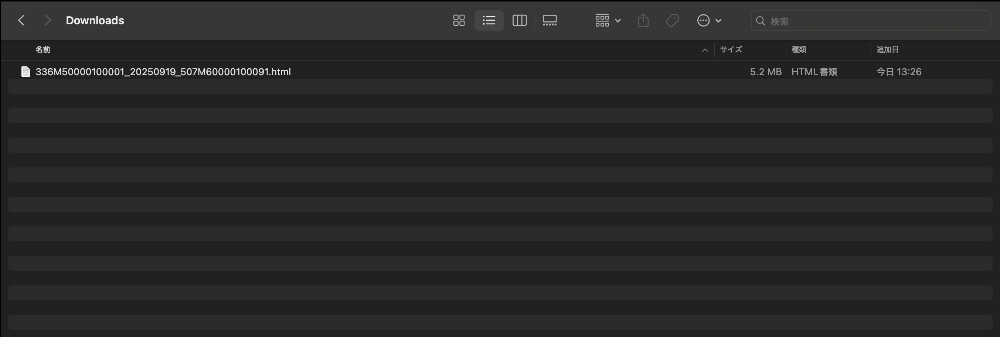
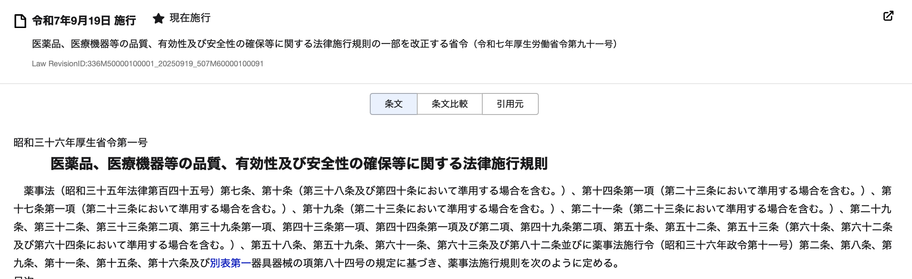
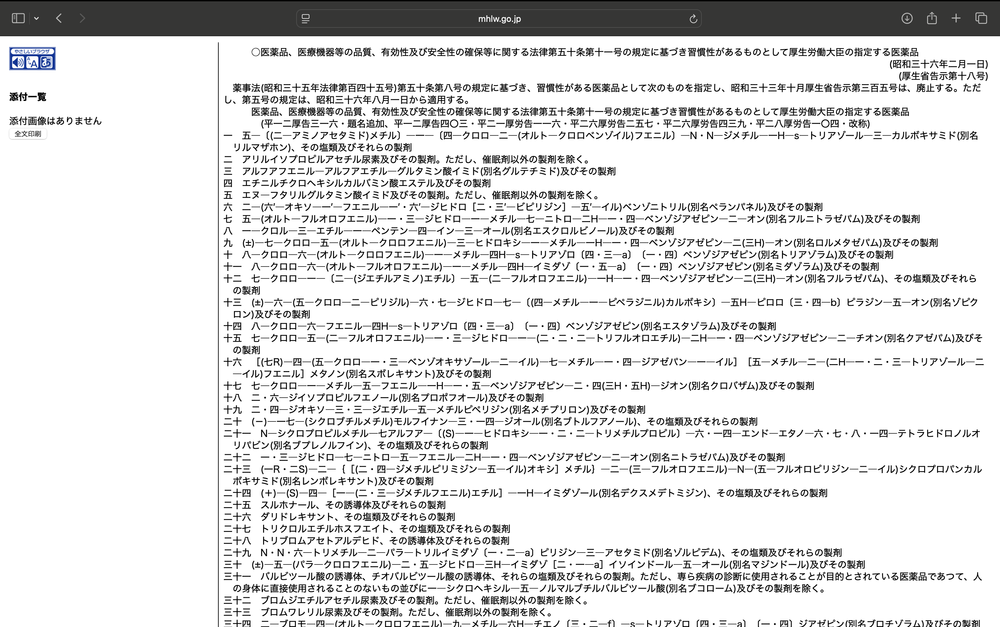

# Document Word Search System

文書内の特定単語を検索し、検索結果の証跡を確実に残すWebアプリケーション

## 📋 概要

HTMLファイル内の特定単語の存在を検索し、検索結果をハイライト表示するとともに、検索証明書を生成してコンプライアンスや監査対応を支援します。

### 主な機能

- ✅ 複数単語の同時検索（OR検索）
- ✅ 日本語・英語対応の柔軟な検索
- ✅ 大文字小文字を区別しない検索
- ✅ ヒット箇所の蛍光ペン風ハイライト表示
- ✅ タイムスタンプ付き検索証明書（JSON）の自動生成
- ✅ SHA256ハッシュによるファイル改ざん検知
- ✅ ポジティブコントロールによる検索機能の正常性証明
- ✅ 全ファイルの検索状況を表示（ヒット0件も含む）

## 🚀 セットアップ

### 必要な環境

- Python 3.8以上
- Webブラウザ（Chrome, Firefox, Safari, Edge等）

### インストール手順

#### macOS / Linux

```bash
# 1. リポジトリのディレクトリに移動
cd WordSearch

# 2. 仮想環境を作成（初回のみ）
python3 -m venv .venv

# 3. 仮想環境を有効化
source .venv/bin/activate

# 4. 依存パッケージをインストール
pip install -r requirements.txt

# 5. アプリケーションを起動
python app.py
```

#### Windows

```bash
# 1. リポジトリのディレクトリに移動
cd WordSearch

# 2. 仮想環境を作成（初回のみ）
python -m venv .venv

# 3. 仮想環境を有効化
.venv\Scripts\activate

# 4. 依存パッケージをインストール
pip install -r requirements.txt

# 5. アプリケーションを起動
python app.py
```

### 初回起動後

ブラウザで以下にアクセス:
```
http://127.0.0.1:5000
```

## 📁 ディレクトリ構成

```
WordSearch/
├── app.py                 # Flaskアプリケーション
├── config.py              # 設定ファイル
├── requirements.txt       # 依存パッケージ
├── download_html.py       # WebページHTMLダウンロードツール
├── data/                  # 検索対象HTMLファイルを配置
├── output/                # 検索結果出力（.gitignoreで除外）
│   └── {検索単語}/
│       └── {タイムスタンプ}/
│           ├── highlighted_{ファイル名}.html  # ハイライト済みHTML
│           └── certificate.json              # 検索証明書
├── modules/               # ビジネスロジック
│   ├── search_engine.py   # 検索エンジン
│   ├── file_manager.py    # ファイル管理
│   ├── highlighter.py     # ハイライト処理
│   ├── certificate.py     # 証明書生成
│   ├── positive_control.py # ポジティブコントロール
│   └── utils.py           # ユーティリティ
├── templates/             # HTMLテンプレート
├── static/                # CSS/JavaScript
└── logs/                  # ログファイル
```

## 📖 使い方

### 1. 検索対象ファイルの配置

#### 方法1: ローカルファイルを配置

`data/` ディレクトリにHTMLファイルを配置します。

```bash
cp your_files/*.html data/
```

#### 方法2: WebページをダウンロードしてHTMLとして保存

```bash
# 仮想環境を有効化した状態で実行
python download_html.py "https://example.com/page.html" "ファイル名.html"
```

**例**:
```bash
python download_html.py "https://www.mhlw.go.jp/web/t_doc?dataId=81aa8798&dataType=0&pageNo=1" "麻薬及び向精神薬取締法.html"
```

ダウンロードされたHTMLは自動的に`data/`フォルダに保存されます。

### 2. 検索の実行

1. ブラウザで `http://127.0.0.1:5000` にアクセス
2. 検索したい単語を入力
   - 日本語: フエニルメチルアミノプロパン、セレン、ニコチンなど
   - 英語: example, test, searchなど
3. 必要に応じて「+ 検索欄を追加」ボタンで複数の単語を追加（最大100個）
4. 「検索実行」ボタンをクリック

### 3. 結果の確認

検索結果画面には、**全ての検索対象ファイル**が表示されます：

- **ヒットした場合**:
  - ファイル名 (N箇所) + 「表示」リンク
  - リンクをクリックするとハイライト表示されたHTMLが開く

- **ヒットしなかった場合**:
  - ファイル名 (0箇所) のみ表示（リンクなし）

#### 出力ファイル

検索実行後、以下のファイルが生成されます：

```
output/
└── {検索単語}/
    └── {YYYYMMDD_HHMMSS}/
        ├── highlighted_{元のファイル名}.html  # ハイライト済みHTML
        ├── highlighted_{元のファイル名2}.html # （複数ヒットの場合）
        └── certificate.json                    # 検索証明書
```

**例**:
```
output/
└── セレン/
    └── 20251020_143052/
        ├── highlighted_毒物及び劇物取締法.html
        └── certificate.json
```

## 🔍 検索証明書の内容

証明書（JSON）には以下の情報が含まれます:

```json
{
  "search_id": "uuid-形式のID",
  "timestamp": "2025-10-20T14:30:52.123456",
  "search_words": ["セレン"],
  "total_files": 6,
  "results": [
    {
      "file": "/path/to/file.html",
      "filename": "file.html",
      "hash": "sha256ハッシュ値",
      "hits": 1,
      "hit_positions": [...],
      "highlighted_file": "/path/to/output/...",
      "highlighted_relative": "セレン/20251020_143052/highlighted_file.html"
    }
  ],
  "positive_control": {
    "executed": true,
    "test_cases": [...],
    "all_passed": true
  },
  "system_info": {
    "python_version": "3.13.0",
    "app_version": "1.0.0"
  },
  "certificate_hash": "証明書自体のSHA256ハッシュ"
}
```

- **検索実行日時**: ISO 8601形式のタイムスタンプ
- **検索単語リスト**: 検索した全単語
- **各ファイルの結果**: ヒット数、位置、ファイルハッシュ
- **ポジティブコントロール**: 検索機能の正常性証明
- **証明書ハッシュ**: 証明書自体の改ざん検知

## ⚙️ 設定

`config.py` で以下の設定を変更できます:

```python
# 検索対象ファイル拡張子
SUPPORTED_EXTENSIONS = ['.html', '.htm']

# 検索設定
MAX_SEARCH_WORDS = 100      # 最大検索単語数
MAX_WORD_LENGTH = 200       # 単語の最大文字数

# ハイライト設定
HIGHLIGHT_COLOR = '#FFFF00' # 黄色（蛍光ペン風）

# Flask設定
DEBUG = True
HOST = '127.0.0.1'
PORT = 5000
```

## 🛠️ 技術スタック

- **バックエンド**: Python 3.8+, Flask 2.3+
- **HTMLパーサー**: BeautifulSoup4 4.12+
- **フロントエンド**: HTML5, CSS3, JavaScript (jQuery 3.6+)
- **データ管理**: ファイルシステムベース（データベース不使用）
- **HTTPクライアント**: requests 2.32+ (download_html.py用)

## 🌐 クロスプラットフォーム対応

このアプリケーションは以下の環境で動作します：

- **macOS**: ✅ 完全対応
- **Linux**: ✅ 完全対応
- **Windows**: ✅ 完全対応（パス区切り文字の違いに対応済み）

Windows環境でも、URL生成時には常に`/`（スラッシュ）を使用するため、ハイライトHTMLへのアクセスに問題ありません。

## 🔐 セキュリティ

- ローカル環境での利用を想定（ユーザー認証不要）
- ファイルパスのサニタイズ処理実装
- XSS対策（Jinja2の自動エスケープ、JavaScriptでのHTMLエスケープ）
- SHA256ハッシュによるファイル完全性チェック

## データ収集の手順

### e-Govに載っている場合
法律や法律施行規則、政令などは検索できる

1. e-Govで法令、規則の検索<br>
https://laws.e-gov.go.jp


2. 検索対象が「医薬品、医療機器等の品質、有効性及び安全性の確保等に関する法律施行規則」の場合は検索欄に「医薬品、医療機器等の品質、有効性及び安全性の確保等に関する法律」を入力


3. 検索でヒットした場合、該当する法令や規則をクリック


4. 「医薬品、医療機器等の品質、有効性及び安全性の確保等に関する法律施行規則」の第204条別表3をデータにしたい時


5. 別表3をクリックする


6. 右下のダウンロードをクリック


7. ファイル名がLae RevisionIDを利用しており、施行日が入っているのでアプリ内でこの日付を使う。



### e-Govに載っていない場合
厚生労働省告示第◯号

1. 「医薬品、医療機器等の品質、有効性及び安全性の確保等に関する法律第五十条第十一号の規定に基づき習慣性があるものとして厚生労働大臣の指定する医薬品」をデータにしたい時、Googleなどのブラウザで検索して厚生労働省の管理下ページにアクセスする。
https://www.mhlw.go.jp/web/t_doc?dataId=81072000&dataType=0&pageNo=1



2. VS codeのTerminalでdownload_html.pyを利用して、上記の厚生労働省管理下のページを指定して、html化する

[html化の詳細はこちら](#方法2:WebページをダウンロードしてHTMLとして保存)


## 🔧 トラブルシューティング

### 検索結果が表示されない

- ブラウザのJavaScriptコンソールを確認
- サーバーログ（ターミナル）を確認
- `output/`フォルダに結果が生成されているか確認

### ハイライトHTMLにアクセスできない

- 検索を実行したPC環境でのみ、ハイライトHTMLにアクセス可能
- 別のPC環境では、同じ検索を実行し直す必要があります
- `output/`フォルダは`.gitignore`で除外されており、Git管理されません

### 日本語が検索できない

- 最新版では日本語検索に対応済み
- 英語は単語境界（\b）を使用、日本語は単語境界なしで検索

## 📚 ドキュメント

詳細な設計書は `docs/` ディレクトリに格納されています:

- [01_要件定義書.md](docs/01_要件定義書.md)
- [02_機能仕様書.md](docs/02_機能仕様書.md)
- [03_画面設計書.md](docs/03_画面設計書.md)
- [05_システム構成図.md](docs/05_システム構成図.md)
- [06_ディレクトリ構成とファイル一覧.md](docs/06_ディレクトリ構成とファイル一覧.md)

## 🤝 貢献

貢献方法については [CONTRIBUTING.md](CONTRIBUTING.md) を参照してください。

- コミットメッセージの規約
- コミット粒度のルール
- プルリクエストの作成方法

## 📝 ライセンス

このプロジェクトは内部利用を目的としています。

---

**Document Word Search System v1.0.0**
🤖 Generated with [Claude Code](https://claude.com/claude-code)
